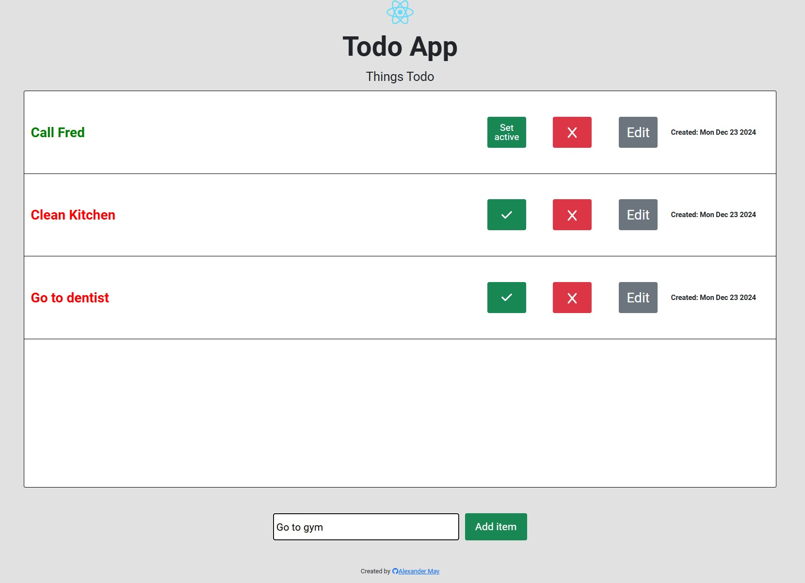

# React Todo App

## Table of Contents
- [Description](#description)
- [Technologies](#tech)
- [Dependencies](#dependencies)
- [Installation](#installation)
- [Features](#features)
- [Future](#future)

### Description

This Todo App handles stores all of your tasks for use at any future point in time. Through this app, one can add, delete or edit specific task items they have stored.

### Technologies Used {#tech}

- HTML 
- SASS 
- Bootstrap 
- JavaScript 
- React 

### Dependencies

To run this app, you must have [node](#https://nodejs.org/en/download/package-manager/current) and [npm](#https://docs.npmjs.com/downloading-and-installing-node-js-and-npm) installed on your device. Directions for doing this can be found by clicking node and npm in this section.

### Installation

To run this project you can run it through the GH pages link on the right sidebar or locally by downloading the files to your PC/cloning the repo.

If you choose to clone the repo through git, you will open your shell/terminal and enter: 
`$ git clone https://github.com/AD-May/react-todo-app`

1. Navigate to the root directory of the project via the terminal with:
`$ cd react-todo-app`
2. Type `$ npm install` and click enter
3. Type `$ npm run dev` and click enter

### Features

1. The ability to add or remove custom tasks from the list.
2. The ability to mark a task as "finished".
3. An option to edit any previously created tasks.
4. Storage of tasks for use at any point in the future.
5. Information on when a specific task was created.

### Future

- [ ] Add more styling
- [ ] Include an alert feature for time until event.

